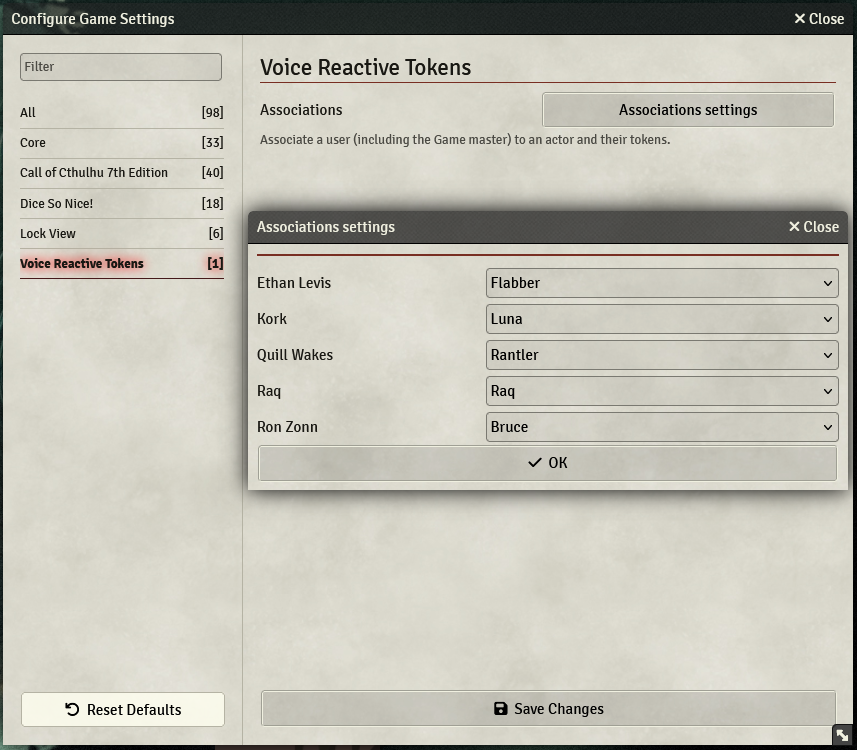

# Voice Reactive Tokens
Light up your tokens when their player talks

This plugin let's you set an owner for an actor and all tokens linked with that actor will light up when the owner speaks.

## Quickstart
To compile the module you have must have `node` installed.

Building the project:
```sh
npm run build
```

The project will be output in the vrt folder.


## How to use
- Create an actor
- As the dm, in the game settings associate the actor to a token

- Enable the use of your microphone
- See how your token lights up as you speak